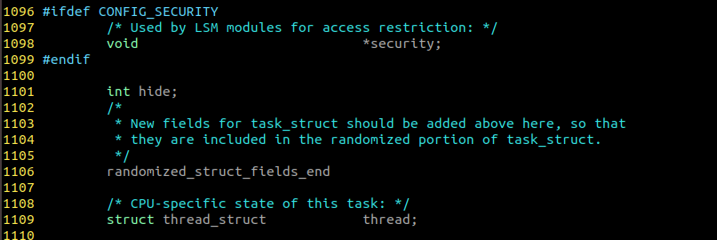
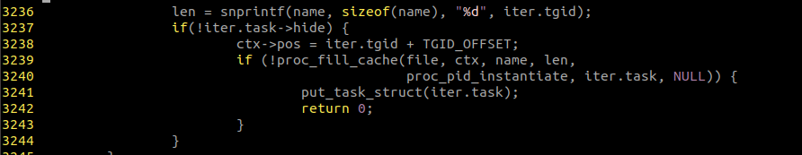
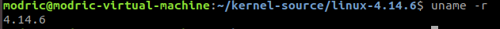

考虑到使用自己修改的内核可能有风险，本次实验使用虚拟机来完成。安装的Linux发行版为Ubuntu 17.10，实验前手动升级内核到目前stable分支的最新版4.14.6，实验时使用的内核源代码也是这个版本。

以下所有操作默认是在kernel源码目录下进行。

在修改 `include/linux/sched.h`中task_struct结构体时，题目说要放在结构体最后，而4.14.6版本的task_struct结构体尾部有这样的说明：

```c
/*
 * New fields for task_struct should be added above here, so that
 * they are included in the randomized portion of task_struct.
 */
randomized_struct_fields_end

/* CPU-specific state of this task: */
struct thread_struct		thread;

/*
 * WARNING: on x86, 'thread_struct' contains a variable-sized
 * structure.  It *MUST* be at the end of 'task_struct'.
 *
 * Do not put anything below here!
 */
};
```

我的理解是，需要添加的部分应该放在randomized_struct_fields_end的前面。


修改`proc_pid_readdir`函数（fs/proc/base.c）时，由于题目中的版本过老，有些变量名发生了改变。我这里修改的情况如下：


在`arch/x86/entry/syscalls/syscall_64.tbl`里加入:

```
    400	common	hide_process		sys_hide_process
    401	common	unhide_process		sys_unhide_process
```

在`include/linux/syscalls.h`的最后加入：

```c
asmlinkage long sys_hide_process(pid_t pid);
asmlinkage long sys_unhide_process(pid_t pid);
```

在`kernel/sys.c`的最后加入：

```c
SYSCALL_DEFINE1(hide_process,  pid_t, pid)
{
	struct task_struct *task;
	if (pid == 0) {
		task = current;
	} else {
		task = find_task_by_vpid(pid);
		if (task == NULL)
			return -1;
	}

	task->hide = 1;

	return 1;
}

SYSCALL_DEFINE1(unhide_process,  pid_t, pid)
{
	struct task_struct *task;
    	if (pid == 0) {
		task = current;
	} else {
		task = find_task_by_vpid(pid);
		if (task == NULL)
			return -1;
													}

	task->hide = 0;

	return 1;
}
```

```bash
cp /boot/config-`uname -r` .config
make mrproper
make menuconfig
sudo make install -j15  #留一个线程看剧
sudo make modules_install
sudo make install
```

安装过程到此结束，接下来是启动过程

```bash
vim /etc/default/grub
```

注释掉`GRUB_HIDDEN_TIMEOUT=0`这一行

```bash
sudo update-grub
sudo reboot
```

选择`Ubuntu高级选项` 找到刚刚装的内核，进入

启动完成后就进入了新内核


